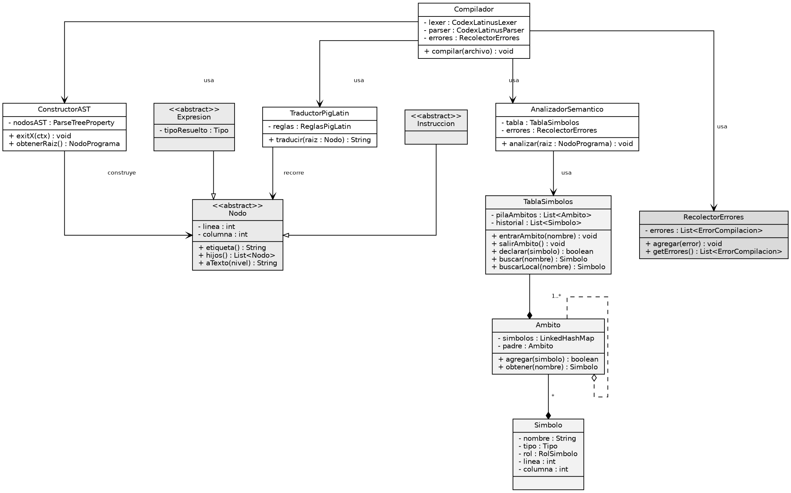

# Codex Latinus

## Descripcion

Compilador de consola con interfaz grafica, desarrollado en Java como Practica 1 del curso Organizacion de Lenguajes y Compiladores 2. Codex Latinus es un lenguaje de programacion de sintaxis inspirada en el latin, implementado con ANTLR4, que valida el codigo fuente en sus fases lexica, sintactica y semantica, grafica su Arbol de Sintaxis Abstracta (AST) y su Tabla de Simbolos, y traduce el lenguaje resultante a PigLatin.

## Caracteristicas

- Analisis lexico y sintactico con ANTLR4, con manejo de errores lexicos, sintacticos y semanticos
- Construccion de un AST propio mediante el patron Listener
- Analisis semantico en cinco pasadas con inferencia y verificacion de tipos
- Tabla de Simbolos con manejo de ambitos anidados
- Graficacion del AST y de la Tabla de Simbolos (Graphviz)
- Simulacion paso a paso de la pila de analisis del parser, con navegacion hacia adelante y hacia atras
- Traduccion del codigo fuente a PigLatin recorriendo el AST
- Interfaz grafica en Java Swing con coloreado de sintaxis
- Gestion de archivos: abrir, guardar y descargar (.lat / .pig)

## Documentacion

- [ManualDeUsuarioCodexLatinus](ManualUsuario_CodexLatinus.pdf)


- [ManualTecnicoCodexLatinus](ManualTecnico_CodexLatinus.pdf)

## Diagrama de Clases (UML)



## Requisitos Previos

- **JDK:** Java 21 o superior
- **Maven:** Para la compilacion y gestion de dependencias
- **ANTLR4:** 4.13.2 (gestionado por el plugin antlr4-maven-plugin)
- **Graphviz:** Para generar los reportes graficos (AST, tabla de simbolos y pila)
- **Sistema Operativo:** Windows, Linux o macOS

### Instalacion de Graphviz (Ubuntu/Debian)

```bash
sudo apt update
sudo apt install graphviz
```

### Formas de compilar el Proyecto

### Usando Maven
```bash
# Compilar el proyecto (genera el lexer y el parser con ANTLR4)
mvn clean compile

# Empaquetar el proyecto
mvn clean package

# Ejecutar el programa
java -jar target/CodexLatinus.jar
```

### Desde un IDE (NetBeans / IntelliJ)
```bash
# Importar el proyecto como Maven Project
# Ejecutar la clase principal:
com.mycompany.practica_1_compi_2_mynor_monzon_1s_2026.VentanaPrincipal
```

### Formato del Archivo de Entrada
El sistema acepta archivos con extension `.lat` escritos en Codex Latinus, por ejemplo:
```bash
VARIABILES[
esto mi_entero : numerus 10;
esto nombre : textum "Somos la resistencia";
]

MAIOR{
mi_entero = 23;
>> nombre;
} FINIS;
```